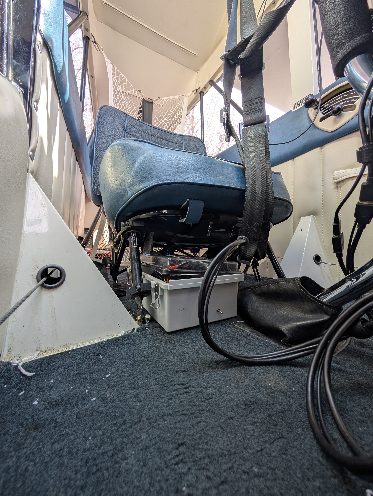
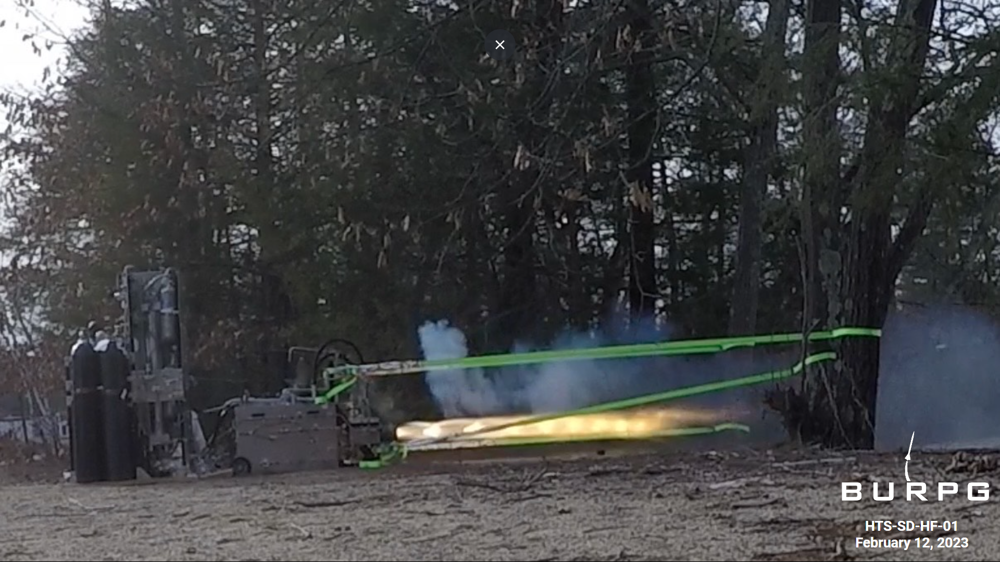

### [Apollo Blade Assembly](https://ablaizot.github.io/portfolio/2025/09/30/Apollo_Assembly.html), BU Electronics Design Facility

I assembled and tested 40 preproduction data acquisition and trigger boards to be used in various experiments at the LHC. In a little over two months, I learned how to assemble the boards and test the FPGAs, before automating as much of the process as possible, and teaching colleagues how to assemble and test the boards themselves. By developing tools to help myself, I completed the preproduction ahead of schedule while also increasing the productivity of those that will handle the production run.

Apollo Blades in their crate at CERN Tracker Integration Facility (TIF)

### [Aerobatic Black Box](https://ablaizot.github.io/portfolio/2025/01/09/Aerobatic-black-box.html), Senior Design Project
This Aerobatic Black Box project aims to provide pilots with a means to review their in-flight performance. Our group's device accomplished this task by integrating digital sensors, cameras, and machine vision to record and digitize flight data and cockpit interactions, eventually incorporating this data into a 3D flight simulator. This visualization allows pilots to analyze their performance from both internal and external perspectives.

Areobatic data recorder mounted below the passenger seat.

### [Icarus](https://ablaizot.github.io/portfolio/2025/01/09/Icarus.html), BURPG
Icarus is a 17-ft long liquid bipropellant rocket using isopropyl alcohol and nitrous oxide that launched on March 29, 2025, reaching 12502 ft AGL (3932 m). The engine, Iron Lotus IV, has a maximum thrust of 2,500 lbf (11 kN). 
I designed and iterated on a PCB for the flight computer. I also wrote flight software for the sampling and logging of the onboard pressure transducers, thermocouples, accelerometers, and barometric altimeters. 

Icarus launching at the Friends of Amateur Rocketry site.

### [Horizontal Test Stand (HTS)](https://ablaizot.github.io/portfolio/2025/01/09/HTS.html), BUPRG
HTS is mobile test stand capable of testing liquid bipropellant engines up to 10,000 lbf. After 3 cold flow operations, HTS fired the Iron Lotus IV engine 3 times in the spring of 2023. I built and ran data acquisition for magnetic pick-up flowmeter and used time frequency analysis to extract flow rate in MATLAB.

HTS firing at Crow Island Airpark.

### [AXI C2C DMA for CERN DAQ Board](https://ablaizot.github.io/portfolio/2025/01/09/DMA_Driver.html), BU Department of Physics
I implemented an AXI DMA with the goal of improving chip to chip communication between the Zynq SoC and two Xilinx Ultrascale+ FPGAs on the Apollo ATCA blades for use at the HL-LHC. This project involved firmware, kernel drivers, and software.

 More information on the Apollo blades can be found in this [paper](https://doi.org/10.1088/1748-0221/20/04/C04001).

### Contact Information
Email: ablaizot@bu.edu
